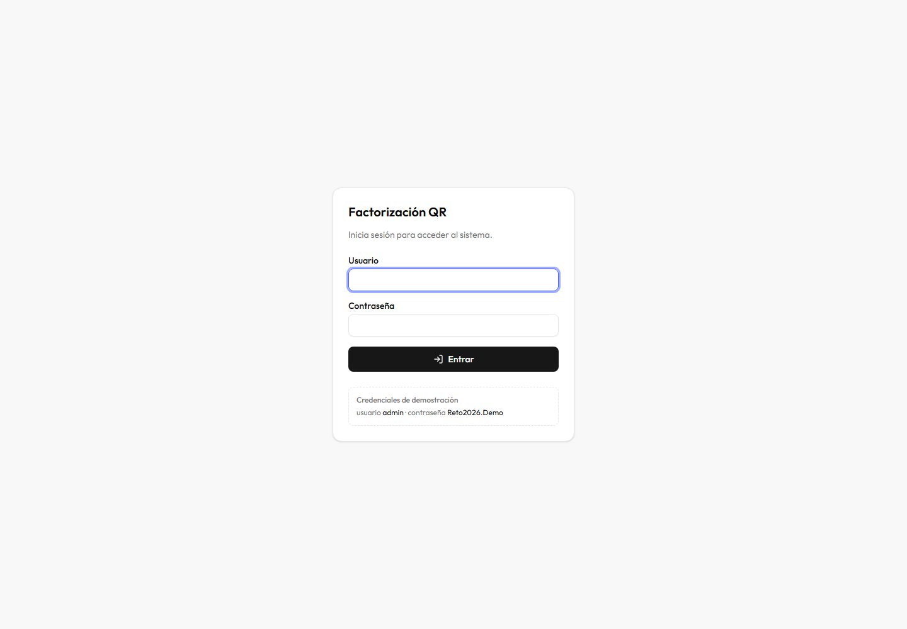

# Documentación del Frontend

Aplicación React que consume el sistema, muestra la factorización y **verifica
su corrección matemática en el navegador**.

**Índice**

1. [Qué se ve en pantalla](#1-qué-se-ve-en-pantalla)
2. [Estructura del proyecto](#2-estructura-del-proyecto)
3. [Los flujos, paso a paso](#3-los-flujos-paso-a-paso)
4. [La verificación en el navegador](#4-la-verificación-en-el-navegador)
5. [Sesión y credenciales](#5-sesión-y-credenciales)
6. [El cliente HTTP](#6-el-cliente-http)
7. [Los componentes](#7-los-componentes)
8. [Presentación de números](#8-presentación-de-números)
9. [Qué se reutilizó del proyecto de referencia](#9-qué-se-reutilizó-del-proyecto-de-referencia)
10. [Ejecución y configuración](#10-ejecución-y-configuración)

---

## 1. Qué se ve en pantalla

### Pantalla de login



Formulario simple. Las credenciales de demostración están **visibles a
propósito**: son estáticas, definidas en el `docker-compose.yml`, y mostrarlas
ahorra a quien revisa tener que buscarlas en el README.

### Pantalla de trabajo


Dos columnas:

| Columna | Contenido |
|---|---|
| **Izquierda** | Dimensiones, cuadrícula editable, ejemplos, modo y tolerancia |
| **Derecha** | Matrices A/Q/R · estadísticas · verificación · metadatos · payload |

### El principio de diseño: un solo clic

**Al entrar ya hay una matriz cargada.** Quien evalúa no necesita escribir nada:
pulsa `Factorizar` y ve el sistema completo funcionando.

### Cada bloque dice de dónde viene

| Bloque | Etiqueta |
|---|---|
| Matrices Q y R | `API en Go · Householder` |
| Estadísticas | `API en Node · vía la API en Go` |
| Residuos | `calculado en el navegador` |

Esto **documenta la arquitectura visualmente**. Quien evalúa ve de un vistazo
qué componente produjo cada dato, sin leer una línea de código.

También responde a la lectura literal del enunciado (*"un frontend que consuma
ambas APIs"*): el frontend **sí** consume ambas, en una sola petición que la API
en Go orquesta. La de Node no está expuesta al navegador —ni debe estarlo— y su
resultado ya viaja en la misma respuesta.

### Los cinco ejemplos, y qué demuestra cada uno

| Botón | Matriz | Qué demuestra |
|---|---|---|
| **Clásica 3×3** | `[[12,-51,4],[6,167,-68],[-4,24,-41]]` | La matriz canónica de los libros. R reproduce `[[-14,-21,14],[0,-175,70],[0,0,35]]` con desviación de ~1e-14 |
| **Rectangular 3×2** | `[[1,2],[3,4],[5,6]]` | El requisito literal del enunciado: matriz no cuadrada |
| **Diagonal** | `[[3,0],[0,5]]` | Activa `isAnyDiagonal = true`, la quinta métrica exigida |
| **Rango deficiente** | `[[1,2],[2,4],[3,6]]` | `R[1][1] ≈ 0` sin división por cero |
| **Mal condicionada** | Matriz de Läuchli | `‖QᵀQ−I‖ ≈ 1e-15` donde Gram-Schmidt daría 0,5 |

El último es el más valioso. Aquí se ve:


Es la demostración **visual y en vivo** de por qué se eligió Householder.

### El botón de matriz aleatoria

Respeta las dimensiones que estén puestas —no fuerza cuadradas, porque el
enunciado pide **rectangular**— y genera **enteros en `[−20, 20]`**. Con
decimales de quince dígitos la cuadrícula quedaría ilegible.

### Redimensionar no borra

Cambiar de 3×3 a 5×3 conserva las nueve celdas anteriores y añade las nuevas a
cero. Perder lo escrito por tocar un selector sería exasperante.

---

## 2. Estructura del proyecto

```
web/src/
├─ app/
│  ├─ router.tsx                 3 rutas
│  └─ layouts/
│     ├─ ProtectedLayout.tsx     guarda de sesión
│     └─ AppLayout.tsx           cabecera común
│
├─ features/
│  ├─ auth/
│  │  ├─ pages/LoginPage.tsx
│  │  ├─ components/SessionExpiredDialog.tsx
│  │  ├─ services/
│  │  │  ├─ auth.service.ts      login, refresh, logout
│  │  │  └─ token.service.ts     lectura del JWT
│  │  └─ store/auth.store.ts     estado de sesión (zustand)
│  │
│  └─ matrix/
│     ├─ pages/WorkspacePage.tsx la pantalla principal
│     ├─ components/
│     │  ├─ MatrixInput.tsx      cuadrícula editable
│     │  ├─ MatrixView.tsx       renderizado de matrices
│     │  ├─ StatisticsPanel.tsx  las cinco métricas
│     │  ├─ VerificationPanel.tsx residuos
│     │  └─ PayloadPanel.tsx     JSON crudo
│     ├─ lib/
│     │  ├─ verification.ts      ÁLGEBRA EN EL NAVEGADOR
│     │  └─ presets.ts           ejemplos
│     ├─ services/qr.service.ts
│     └─ types/qr.types.ts       el contrato
│
├─ shared/lib/
│  ├─ api.ts                     cliente HTTP + interceptores
│  └─ format.ts                  presentación de números
│
└─ components/ui/                shadcn
```

**Organización por funcionalidad, no por tipo de fichero.** Todo lo relacionado
con autenticación vive en `features/auth/`: sus páginas, componentes, servicios
y estado. Es más fácil de navegar que tener `components/`, `services/` y
`stores/` separados con piezas de todo mezcladas.

---

## 3. Los flujos, paso a paso

### 3.1 Entrar en la aplicación

```
Usuario abre http://localhost:5173
        │
        ▼
  ProtectedLayout
        │
        ├─ ¿zustand ya restauró el estado guardado?
        │     NO  →  mostrar "Cargando…"     ← IMPORTANTE
        │     SÍ  →  seguir
        │
        ├─ ¿hay token guardado?
        │     NO  →  redirigir a /login
        │     SÍ  →  mostrar la aplicación
```

**Por qué se espera a la restauración.** Sin esa espera, recargar la página
redirigiría al login durante un instante aunque la sesión siguiera siendo
válida: el token todavía no se ha leído de `localStorage` y el guarda lo
interpreta como "no autenticado".

**Por qué se comprueba solo la presencia y no la vigencia.** Un token caducado
no expulsa al usuario: el interceptor lo renovará de forma transparente en la
primera petición. Echarlo cuando la cookie de refresco sigue viva sería cerrarle
la sesión sin necesidad.

### 3.2 Login

```
1. El usuario escribe usuario y contraseña
2. zod valida que ambos campos vengan rellenos
3. POST /api/v1/auth/login
4. El backend responde con el access token en el cuerpo
   y el refresh token en una cookie HttpOnly
5. El store guarda el access token
6. Redirección a /
```

La validación del formulario **solo comprueba presencia**. Cualquier regla
adicional —longitud mínima, formato— filtraría información sobre las
credenciales válidas antes incluso de enviarlas.

### 3.3 Factorizar

```
1. El usuario ajusta la matriz (o carga un ejemplo)
2. Pulsa "Factorizar"
3. POST /api/v1/qr con { matrix, mode, tolerance? }
   → el interceptor añade el token automáticamente
4. Llega la respuesta con A, Q, R y las estadísticas
5. El navegador RECALCULA Q·R y QᵀQ  ← la verificación
6. Se pinta todo
```

El paso 5 se memoriza con `useMemo`: implica productos de matrices y solo debe
recalcularse cuando llega un resultado nuevo, no en cada renderizado.

### 3.4 Renovación automática de sesión

Este es el flujo más delicado del frontend.

```
Petición cualquiera  ──▶  401
        │
        ▼
  ¿Es una ruta de /auth/*?
        SÍ  →  no renovar (un 401 del login es "credenciales malas")
        NO  →  seguir
        │
        ▼
  ¿Ya se reintentó esta petición?
        SÍ  →  rendirse (evita bucles)
        NO  →  seguir
        │
        ▼
  Renovar  ──▶  POST /auth/refresh (con la cookie y la cabecera CSRF)
        │
        ├─ ÉXITO  →  reintentar la petición original con el token nuevo
        │             (para quien llamó, la renovación fue INVISIBLE)
        │
        └─ FALLO  →  limpiar la sesión + mostrar el aviso de caducidad
```

#### El detalle que evita cerrar sesiones por error

Si tres peticiones fallan a la vez con 401, se lanzarían **tres renovaciones**.
Y como el backend **rota** el refresh token en cada canje, la segunda llegaría
con un token ya consumido. El servidor lo interpretaría como una
**reutilización** —la firma de un token robado— y revocaría la familia entera,
**cerrando la sesión del usuario legítimo**.

La solución son cinco líneas:

```ts
let refreshInFlight: Promise<string | null> | null = null;

function refreshOnce(): Promise<string | null> {
  refreshInFlight ??= refreshSession().finally(() => {
    refreshInFlight = null;
  });
  return refreshInFlight;
}
```

Todas las peticiones que fallen a la vez comparten **una única promesa**. N
renovaciones se convierten en una.

> Es un ejemplo de acoplamiento sutil entre frontend y backend: la política de
> rotación del servidor obliga a una garantía concreta en el cliente.

### 3.5 Cuando la sesión no se puede recuperar

Aparece un diálogo explicando qué pasó, con un botón que lleva al login.

Redirigir en silencio dejaría a quien lo usa preguntándose qué hizo mal y si
perdió su trabajo. El refresco falla por tres motivos —la cookie caducó, se
cerró sesión en otra pestaña, o el backend detectó una reutilización y revocó la
familia— y en los tres la salida es la misma.

---

## 4. La verificación en el navegador

Es la característica que distingue esta interfaz de una demo normal.

### 4.1 La idea

El panel de verificación **no muestra datos que venga de la API**. Recalcula por
su cuenta las dos identidades que definen una factorización QR:

```
1. A = Q · R      ¿reconstruye la matriz original?
2. Qᵀ · Q = I     ¿son las columnas de Q ortonormales?
```

Y muestra cuánto se desvía el resultado recibido:

```
‖A − Q·R‖   2.84e-14   ✓   La factorización reconstruye la matriz original
‖QᵀQ − I‖   3.33e-16   ✓   Las columnas de Q son ortonormales
```

**El cliente no confía en el servidor: lo comprueba.** La corrección del
algoritmo deja de ser una afirmación de quien produjo el resultado.

### 4.2 Por qué la segunda identidad es la interesante

Gram-Schmidt clásico **también** satisface `A = Q·R`. Lo que pierde es la
ortogonalidad de Q cuando la matriz está mal condicionada.

Es decir: la primera comprobación no distingue un algoritmo estable de uno
inestable. **La segunda sí.**

Cargando el ejemplo *Mal condicionada* se ve `‖QᵀQ − I‖ ≈ 1e-15`, donde
Gram-Schmidt daría `0,5`.

### 4.3 Cómo está implementado

Son unas 100 líneas en `features/matrix/lib/verification.ts`, sin dependencias:

```ts
export function multiply(a: number[][], b: number[][]): number[][] | null
export function transpose(m: number[][]): number[][]
export function identity(n: number): number[][]
export function maxAbsDifference(a: number[][], b: number[][]): number | null
export function verifyFactorization(a, q, r): Check[]
```

Dos detalles:

**El bucle va i-k-j**, no el clásico i-j-k. Así se recorren ambas matrices por
filas y se aprovecha la línea de caché, en lugar de saltar por columnas.

**Se usa la norma del máximo**, no la de Frobenius. Acota el **peor** elemento;
una norma que promedia podría diluir un único valor muy erróneo entre cientos de
valores correctos.

### 4.4 El umbral

```ts
const RESIDUAL_TOLERANCE = 1e-9;
```

El epsilon de la máquina en doble precisión ronda `2,2e-16`. El error crece con
el tamaño y el condicionamiento de la matriz, así que se deja margen amplio: lo
que se quiere detectar es un **algoritmo equivocado**, que fallaría por varios
órdenes de magnitud, no la acumulación normal de redondeo.

---

## 5. Sesión y credenciales

### 5.1 Dónde vive cada cosa

| Credencial | Dónde | Vida | ¿La lee JavaScript? |
|---|---|---|---|
| **Access token** | Memoria + `localStorage` | 15 min | Sí |
| **Refresh token** | Cookie `HttpOnly` | 7 días | **No** |

### 5.2 El compromiso, explicado

Guardar el access token en `localStorage` significa que **un XSS podría
leerlo**. Es un riesgo asumido a cambio de que recargar la página no obligue a
reautenticarse.

Está acotado por dos razones:

1. Su vida es de **15 minutos**.
2. El refresh token —la credencial de verdad, la de vida larga— está en una
   cookie `HttpOnly` que **JavaScript no puede leer**. Un XSS no puede robarla.

La alternativa —mantener el access token solo en memoria— obligaría a renovar en
cada recarga de página. Es más seguro y menos cómodo; con 15 minutos de vida, el
compromiso elegido es razonable.

### 5.3 El store

`zustand` con `persist`, versión reducida del proyecto de referencia:

```ts
interface AuthState {
  accessToken: string | null;
  username: string | null;
  sessionExpired: boolean;    // dispara el aviso
  hydrated: boolean;          // ¿ya se restauró localStorage?

  login, logout, refreshSession, isAuthenticated, …
}
```

Solo se persisten `accessToken` y `username`. `sessionExpired` y `hydrated` son
estado de la sesión actual del navegador: persistirlos haría que la aplicación
arrancara mostrando un aviso heredado de la visita anterior.

**Eliminado del original:** permisos, tenant, sucursal, empresa, usuarios
guardados, chat, caja. Este proyecto no tiene ninguno de esos conceptos.

---

## 6. El cliente HTTP

`shared/lib/api.ts` concentra dos preocupaciones que, dispersas por los
componentes, se olvidarían en alguna llamada nueva.

### 6.1 Configuración base

```ts
export const api = axios.create({
  baseURL: import.meta.env.VITE_API_URL ?? "http://localhost:8080",
  withCredentials: true,                    // ← para que viaje la cookie
  headers: {
    "Content-Type": "application/json",
    "X-Refresh-Request": "1",               // ← defensa CSRF
  },
});
```

**`withCredentials: true` es imprescindible.** Sin él, el navegador no envía la
cookie del refresh token: el login funcionaría y la renovación fallaría siempre,
con un síntoma —"sesión caducada a los 15 minutos"— que no apunta a su causa.

### 6.2 Interceptor de petición

Añade el token de acceso a cada llamada.

### 6.3 Interceptor de respuesta

Implementa el flujo de renovación descrito en la sección 3.4.

### 6.4 Por qué se inyectan las funciones del store

Hay un ciclo de dependencias natural: el store necesita `api` para hacer las
llamadas, y `api` necesita al store para leer el token.

Se rompe con inyección:

```ts
// api.ts declara lo que necesita
export function configureApi(handlers: {
  getAccessToken: () => string | null;
  refreshSession: () => Promise<string | null>;
  onSessionLost: () => void;
}) { … }

// auth.store.ts lo proporciona al cargarse
configureApi({
  getAccessToken: () => useAuthStore.getState().accessToken,
  refreshSession: () => useAuthStore.getState().refreshSession(),
  onSessionLost:  () => useAuthStore.setState({ accessToken: null, sessionExpired: true }),
});
```

Por eso `main.tsx` importa el store por su efecto de módulo.

### 6.5 Traducción de errores

```ts
export function toApiError(error: unknown): ApiError
```

Prefiere el mensaje del backend: está redactado para el usuario y es coherente
entre servicios. Los mensajes de axios —*"Request failed with status code
422"*— no dicen nada útil a quien está usando la aplicación.

Distingue además el caso **sin respuesta**, que tiene dos causas que conviene
señalar juntas: el servidor no está levantado, o la petición fue bloqueada por
CORS.

---

## 7. Los componentes

### `MatrixInput`

Selector de dimensiones, cuadrícula editable, botones de ejemplos, matriz
aleatoria, modo y tolerancia.

**Límite de 12×12.** La API admite hasta 512×512, pero renderizar esa cuadrícula
serían **262 144 campos de entrada** y el navegador se bloquearía. El techo es
de la interfaz, no del backend, y así lo indica el tooltip.

Una celda vacía o a medio escribir (`-`, `1.`) cuenta como cero en el modelo,
pero el campo conserva el texto mientras se escribe.

### `MatrixView`

Renderiza una matriz con corchetes dibujados con **bordes CSS**, no con
caracteres `[`: así escalan con el alto real de la matriz.

Los números usan **cifras tabulares** (`font-variant-numeric: tabular-nums`).
Sin eso, el `1` es más estrecho que el `8` y las columnas se ven torcidas. En una
herramienta cuyo objeto son las matrices, la alineación no es estética sino de
legibilidad.

**Los ceros estructurales de R se pintan en gris.** Son ceros que el algoritmo
produce por construcción, y atenuarlos hace que la forma triangular superior
salte a la vista.

### `StatisticsPanel`

Cuatro tarjetas con las métricas globales, el indicador de matriz diagonal
—incluyendo **cuáles** lo son— y una tabla con el desglose por matriz.

### `VerificationPanel`

Los residuos, con indicador visual de aprobado. Ver la sección 4.

### `PayloadPanel`

Acordeón con la petición y la respuesta HTTP, y botón de copiar.

Existe para la comodidad de quien revisa: permite ver el contrato exacto de la
API sin abrir las herramientas de desarrollo ni un cliente HTTP aparte.

**Es de solo lectura a propósito.** Hacerlo editable obligaría a sincronizar en
ambos sentidos el JSON con la cuadrícula, y a decidir qué hacer cuando alguien
pega una matriz de 200×200 que el grid no puede representar. El beneficio —ver
el contrato— se obtiene igual sin asumir esa complejidad.

---

## 8. Presentación de números

Un detalle pequeño con impacto grande en cómo se percibe la herramienta.

### El problema

Los resultados de una factorización **casi nunca son enteros exactos**:

```
Teoría:  R = [[-14, -21, 14], [0, -175, 70], [0, 0, 35]]
Real:    R = [[-14, -21.000000000000007, 14.000000000000004], …]
```

Sin tratamiento, la misma matriz mostraría `-14` en una celda y `-21.0000` en la
de al lado, sugiriendo una diferencia de precisión **que no existe**.

### La solución

```ts
const INTEGER_TOLERANCE = 1e-9;

function isNearInteger(value: number): boolean {
  const nearest = Math.round(value);
  return Math.abs(value - nearest) <= INTEGER_TOLERANCE * Math.max(1, Math.abs(value));
}
```

**No oculta nada.** A las cuatro cifras decimales que se muestran, `-21.0000` y
`-21` son el mismo número. Y el valor completo sigue disponible en el panel de
payload.

### Las tres reglas

| Caso | Formato | Por qué |
|---|---|---|
| Cero exacto | `0` | En R son ceros estructurales; `0.0000` sugeriría un cálculo |
| Casi entero | `-21` | Consistencia visual |
| Magnitud < 1e-4 o ≥ 1e6 | `1.00e-8` | `0.00000001` en una celda estrecha se lee como cero |
| Resto | `-0.8571` | Cuatro decimales |

Los **residuos** siempre van en notación científica: lo relevante es el **orden
de magnitud**. La diferencia entre `1e-16` y `1e-1` es la que separa un
algoritmo estable de uno que no lo es, y en notación decimal se pierde de vista.

---

## 9. Qué se reutilizó del proyecto de referencia

El sistema de diseño de partida es un panel de administración con **33
features**, RBAC, i18n, Firebase, mapas y websockets. Su `router.tsx` tiene
**455 líneas y 58 imports**.

Copiarlo entero para una aplicación de dos pantallas habría sido el mismo error
que aplicar arquitectura hexagonal a un servicio que no la necesita.

### Reutilizado

| Pieza | Cómo |
|---|---|
| React 19 · Vite · TypeScript · Tailwind v4 | Tal cual |
| Componentes shadcn y sus tokens | Copiados |
| `TokenService` | Adaptado, quitando la extracción de permisos |
| Patrón `ProtectedLayout` | Adaptado, sin RBAC |
| Estructura `app/` + `features/` + `shared/` | Tal cual |
| zustand con `persist` | Store podado |

### Descartado

RBAC y `PermissionRoute` · i18n · Firebase · los 13 layouts · las 33 features ·
mapas · websockets · `react-table` · `recharts` · `driver.js` · exportación a
PDF.

### Añadido

**El interceptor de respuesta con cola de reintentos.** El proyecto original
solo tiene interceptor de petición; la renovación la maneja un componente que
vigila el reloj. El patrón implementado aquí reacciona al 401 real, no a un
reloj que puede desincronizarse con el del servidor.

**La paleta oscura.** El proyecto de referencia declaraba el variante `dark`
pero **nunca definió los tokens** de shadcn, así que los componentes seguían
leyendo los valores claros. Se completó con la paleta neutral estándar.

### El resultado

```
Proyecto de referencia     Este proyecto
─────────────────────      ─────────────
33 features                3 features
455 líneas de router       ~30 líneas
13 layouts                 2 layouts
~60 dependencias           ~20 dependencias
```

---

## 10. Ejecución y configuración

### Requisitos

- Node 20 o superior
- El backend levantado (`docker compose up -d --build` desde la raíz)

### Arranque

```bash
cd web
npm install
cp .env.example .env
npm run dev
```

→ **http://localhost:5173** · usuario `admin` · contraseña `Reto2026.Demo`

### Comandos

| Comando | Qué hace |
|---|---|
| `npm run dev` | Servidor de desarrollo con recarga en caliente |
| `npm run build` | Compilación de producción a `dist/` |
| `npm run preview` | Sirve la compilación de producción |
| `npm run lint` | Análisis estático |

### Variables de entorno

| Variable | Por defecto | Descripción |
|---|---|---|
| `VITE_API_URL` | `http://localhost:8080` | URL base de la API en Go |

Solo hay una. El frontend **nunca habla con la API de Node**: no está expuesta,
y su resultado ya viene en la respuesta de Go.

### El puerto 5173 es fijo

```ts
server: { port: 5173, strictPort: true }
```

Es el origen que la API en Go declara en `CORS_ORIGINS`. Si Vite eligiera otro
al estar ocupado, el navegador bloquearía todas las peticiones y el fallo sería
difícil de diagnosticar: la aplicación cargaría bien y solo fallarían las
llamadas, con un error de CORS en consola que no menciona el puerto.

Con `strictPort`, Vite **falla al arrancar** si el 5173 está ocupado. Un fallo
visible es mejor que uno silencioso.

### Problemas frecuentes

| Síntoma | Causa probable | Solución |
|---|---|---|
| "No se pudo contactar con la API" | El backend no está levantado | `docker compose up -d` desde la raíz |
| Error de CORS en consola | Vite arrancó en otro puerto, o `CORS_ORIGINS` no lo incluye | Verificar que sea el 5173 y revisar la variable |
| El login funciona pero la sesión cae a los 15 min | La cookie de refresco no está viajando | Comprobar `withCredentials: true` y que `CORS_ORIGINS` no sea `*` |
| 401 con `missing_csrf_header` | La cabecera `X-Refresh-Request` no se está enviando | Comprobar la configuración base de axios |
