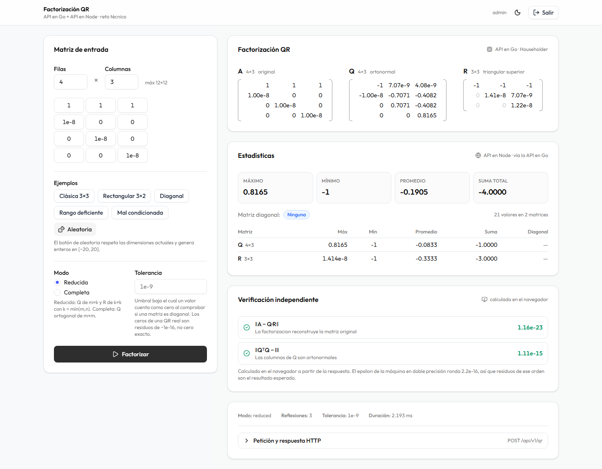

# Frontend

> **El frontend vive en un repositorio aparte:**
> **[ProDevelop123/factorizacion-QR](https://github.com/ProDevelop123/factorizacion-QR)**
>
> Está separado para que **Vercel lo despliegue automáticamente** en cada push,
> sin tener que configurar un directorio raíz dentro de un monorepo.
>
> La documentación detallada —656 líneas con los flujos paso a paso, la
> verificación en el navegador, el manejo de sesión, los componentes y la
> presentación de números— viaja con él, en
> [`docs/frontend.md`](https://github.com/ProDevelop123/factorizacion-QR/blob/main/docs/frontend.md).

Esta página resume lo esencial para quien lea el backend y quiera entender qué
hay al otro lado, sin tener que cambiar de repositorio.

---


## Qué es

Una aplicación React 19 (Vite, TypeScript, Tailwind v4, shadcn/ui) con dos
pantallas: login y área de trabajo.

Consume **una sola llamada** a la API en Go —`POST /api/v1/qr`— que devuelve la
matriz original, Q, R y las estadísticas del servicio en Node. El frontend
**nunca habla con la API de Node**: no está expuesta, y su resultado ya viene en
la misma respuesta.

## Las tres ideas

### 1. La primera factorización cuesta un clic

Al entrar ya hay una matriz cargada. Quien evalúa no necesita escribir nada.

Hay además cinco ejemplos, y **ninguno es decorativo**:

| Ejemplo | Qué demuestra |
|---|---|
| Clásica 3×3 | La matriz canónica de los libros; R reproduce `[[-14,-21,14],[0,-175,70],[0,0,35]]` con desviación de ~1e-14 |
| Rectangular 3×2 | El requisito literal del enunciado: matriz no cuadrada |
| Diagonal | Activa `isAnyDiagonal = true`, la quinta métrica exigida |
| Rango deficiente | `R[1][1] ≈ 0` sin división por cero |
| Mal condicionada | Matriz de Läuchli: `‖QᵀQ−I‖ ≈ 1e-15` donde Gram-Schmidt daría 0,5 |

### 2. El navegador verifica al backend

El panel de verificación **no muestra datos de la API**. Recalcula `Q·R` y `QᵀQ`
en JavaScript y mide los residuos:

```
‖A − Q·R‖   2.84e-14   ✓   La factorización reconstruye la matriz original
‖QᵀQ − I‖   3.33e-16   ✓   Las columnas de Q son ortonormales
```

**El cliente no confía en el servidor: lo comprueba.** La corrección del
algoritmo deja de ser una afirmación de quien produjo el resultado.

La segunda identidad es la interesante: Gram-Schmidt clásico **también**
satisface `A = Q·R`, así que la primera comprobación no distingue un algoritmo
estable de uno inestable. La segunda sí.



### 3. Cada resultado dice de dónde viene

| Bloque | Etiqueta en pantalla |
|---|---|
| Matrices Q y R | `API en Go · Householder` |
| Estadísticas | `API en Node · vía la API en Go` |
| Residuos | `calculado en el navegador` |

Documenta la arquitectura visualmente, y responde a la lectura literal del
enunciado (*"un frontend que consuma ambas APIs"*): el frontend **sí** consume
ambas, en una sola petición que la API en Go orquesta.

## El detalle que conecta frontend y backend

La renovación de sesión ocurre en el **interceptor de respuesta**: ante un 401
se renueva el token y se reintenta la petición original, de forma invisible para
quien llamó.

Con un matiz que no es opcional. Si tres peticiones fallan a la vez, se
lanzarían tres renovaciones. Y como el backend **rota** el refresh token en cada
canje, la segunda llegaría con un token ya consumido: el servidor lo
interpretaría como una **reutilización** —la firma de un token robado— y
revocaría la familia entera, **cerrando la sesión del usuario legítimo**.

La solución son cinco líneas que hacen que todas compartan una única promesa.

> Es un ejemplo de acoplamiento sutil entre los dos lados: la política de
> rotación del servidor obliga a una garantía concreta en el cliente. Está
> explicado en detalle en la documentación del repositorio del frontend.

## Cómo ejecutarlo

```bash
git clone https://github.com/ProDevelop123/factorizacion-QR.git
cd factorizacion-QR
npm install
cp .env.example .env      # VITE_API_URL=http://localhost:8080
npm run dev
```

→ http://localhost:5173 · usuario `admin` · contraseña `Reto2026.Demo`

Requiere este backend levantado:

```bash
docker compose up -d --build
```

El puerto **5173 es fijo**: es el origen que la API en Go declara en
`CORS_ORIGINS`. Si cambia, hay que actualizar esa variable o el navegador
bloqueará todas las peticiones.
